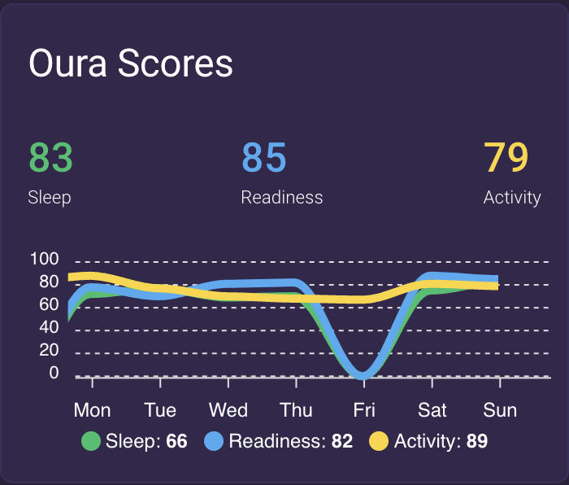
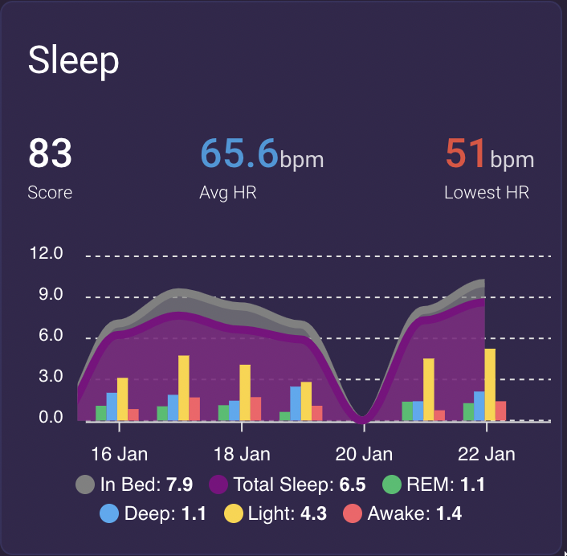

# Oura - Custom Component for Home-Assisant

This project is a custom component for [Home-Assistant](https://home-assistant.io).

The component sensors with sleep data for previous days from [Oura Ring](https://ouraring.com/).


## Sponsoring

If this is helpful, feel free to `Buy Me a Beer`; or check other options on the Github `❤️ Sponsor` link on the top of this page.

<a href="https://www.buymeacoffee.com/nitobuendia" target="_blank"></a>


## Table of Contents

- [Oura - Custom Component for Home-Assisant](#oura---custom-component-for-home-assisant)
  - [Sponsoring](#sponsoring)
  - [Table of Contents](#table-of-contents)
  - [Installation](#installation)
  - [Configuration](#configuration)
    - [Schema](#schema)
    - [Parameters](#parameters)
    - [Top level parameters](#top-level-parameters)
    - [Sensors parameters](#sensors-parameters)
    - [Individual sensor parameters](#individual-sensor-parameters)
    - [Example](#example)
    - [How to get personal Oura token](#how-to-get-personal-oura-token)
  - [Sensors](#sensors)
    - [Common attributes](#common-attributes)
      - [Monitored days](#monitored-days)
      - [Backfilling](#backfilling)
        - [What is Backfilling and why it is needed](#what-is-backfilling-and-why-it-is-needed)
        - [Rule of thumb](#rule-of-thumb)
        - [Full backfilling logic](#full-backfilling-logic)
    - [Activity Sensor](#activity-sensor)
      - [Activity Sensor state](#activity-sensor-state)
      - [Activity Sensor monitored attributes](#activity-sensor-monitored-attributes)
      - [Activity Sensor sample output](#activity-sensor-sample-output)
    - [Heart Rate Sensor](#heart-rate-sensor)
      - [Heart Rate Sensor state](#heart-rate-sensor-state)
      - [Heart Rate Sensor monitored attributes](#heart-rate-sensor-monitored-attributes)
      - [Heart Rate Sensor sample output](#heart-rate-sensor-sample-output)
    - [Bedtime Sensor](#bedtime-sensor)
      - [Bedtime Sensor state](#bedtime-sensor-state)
      - [Bedtime Sensor monitored attributes](#bedtime-sensor-monitored-attributes)
      - [Bedtime Sensor sample output](#bedtime-sensor-sample-output)
    - [Readiness Sensor](#readiness-sensor)
      - [Readiness Sensor state](#readiness-sensor-state)
      - [Readiness Sensor monitored attributes](#readiness-sensor-monitored-attributes)
      - [Readiness Sensor sample output](#readiness-sensor-sample-output)
    - [Sessions Sensor](#sessions-sensor)
      - [Sessions Sensor state](#sessions-sensor-state)
      - [Sessions Sensor monitored attributes](#sessions-sensor-monitored-attributes)
      - [Sessions Sensor sample output](#sessions-sensor-sample-output)
    - [Sleep Sensor](#sleep-sensor)
      - [Sleep Sensor State](#sleep-sensor-state)
      - [Sleep Sensor monitored attributes](#sleep-sensor-monitored-attributes)
      - [Sleep Sensor sample output](#sleep-sensor-sample-output)
    - [Sleep Periods Sensor](#sleep-periods-sensor)
      - [Sleep Periods Sensor State](#sleep-periods-sensor-state)
      - [Sleep Periods Sensor monitored attributes](#sleep-periods-sensor-monitored-attributes)
      - [Sleep Periods Sensor sample output](#sleep-periods-sensor-sample-output)
    - [Sleep Score Sensor](#sleep-score-sensor)
      - [Sleep Score Sensor State](#sleep-score-sensor-state)
      - [Sleep Score Sensor monitored attributes](#sleep-score-sensor-monitored-attributes)
      - [Sleep Score Sensor sample output](#sleep-score-sensor-sample-output)
    - [Workouts Sensor](#workouts-sensor)
      - [Workouts Sensor state](#workouts-sensor-state)
      - [Workouts Sensor monitored attributes](#workouts-sensor-monitored-attributes)
      - [Workouts Sensor sample output](#workouts-sensor-sample-output)
    - [Derived sensors](#derived-sensors)
    - [Sensors and Lovelace](#sensors-and-lovelace)
      - [Custom Cards](#custom-cards)
        - [Using apexcharts-card](#using-apexcharts-card)
          - [Score card using apexcharts-card](#score-card-using-apexcharts-card)
          - [Sleep trend card using apexcharts-card](#sleep-trend-card-using-apexcharts-card)
  - [Frequently Asked Questions (FAQs) and Common Issues](#frequently-asked-questions-faqs-and-common-issues)

## Installation

1. Copy the files from the `custom_component/oura/` folder into the `custom_component/oura/` of your Home-Assistant installation.

1. Configure the sensors following the instructions in `Configuration`.
1. Restart the Home-Assistant instance.

## Configuration

### Schema

Under your `configuration.yaml`, you should include the `sensor` platform under which you should add the following configuration:

`configuration.yaml`

```yaml
sensor:
  - platform: oura
    access_token:
    scan_interval:
    sensors:
      activity:
        name:
        attribute_state:
        max_backfill:
        monitored_dates:
        monitored_variables:
      heart_rate:
        name:
        attribute_state:
        max_backfill:
        monitored_dates:
        monitored_variables:
      readiness:
        name:
        attribute_state:
        max_backfill:
        monitored_dates:
        monitored_variables:
      sleep:
        name:
        attribute_state:
        max_backfill:
        monitored_dates:
        monitored_variables:
      sleep_periods:
        name:
        attribute_state:
        max_backfill:
        monitored_dates:
        monitored_variables:
      sleep_score:
        name:
        attribute_state:
        max_backfill:
        monitored_dates:
        monitored_variables:
      workouts:
        name:
        attribute_state:
        max_backfill:
        monitored_dates:
        monitored_variables:
  # (...) Potentially other sensors that you may have configured.

# (...) Other code on your configuration.yaml file.
```

Note: Make sure there are no two sensor platforms. If you already have one `sensor:` configuration, make sure to merge this code with yours.

### Parameters

### Top level parameters

- `access_token`: Personal Oura token. See `How to get personal Oura token` section for how to obtain this data.
- `scan_interval`: (Optional) Set how many seconds should pass in between refreshes. As the sleep data should only refresh once per day, we recommend to update every few hours (e.g. 7200 for 2h or 21600 for 6h).
- `sensors`: (Optional) Determines which sensors to import and its configuration.

### Sensors parameters

- `activity`: (Optional) Configures activity sensor. By default, the activity sensor is not configured. Default name: oura_activity.
- `heart_rate`: (Optional) Configures heart rate sensor. By default, the heart rate sensor is not configured. Default name: oura_heart_rate.
- `readiness`: (Optional) Configures readiness sensor. By default, the readiness sensor is not configured. Default name: oura_readiness.
- `sleep`: (Optional) Configures sleep sensor. By default the sleep sensor is added. Default name: oura_sleep.
- `sleep_periods`: (Optional) Configures sleep periods sensor. By default, the sleep periods sensor is not configured. Default name: oura_sleep_periods.
- `workouts`: (Optional) Configures workouts sensor. By default, the workouts sensor is not configured. Default name: oura_workouts.

### Individual sensor parameters

- `name`: (Optional) Name of the sensor (e.g. sleep_score).
- `attribute_state`: (Optional) What monitored variable (i.e. attribute) will be used to define the main state of the sensor. To see the default values, check the `state` section within each sensor description below.
- `max_backfill`: (Optional) How many days before to backfill if a day of data is not available. See `Backfilling strategy` section to understand how this parameter works. Default: 0.
- `monitored_dates`: (Optional) Days that you want to monitor. See `Monitored days` section to understand what day values are supported. Default: yesterday.
- `monitored_variables`: (Optional) Variables that you want to monitor. See `monitored attributes` section within each sensor description below to understand what variables are supported.

### Example

```yaml
sensor:
  - platform: oura
    access_token: !secret oura_api_token
    scan_interval: 7200 # 2h = 2h * 60min * 60 seconds
    sensors:
      readiness: {}
      sleep:
        name: sleep_data
        max_backfill: 3
        monitored_dates:
          - yesterday
          - monday
          - tuesday
          - wednesday
          - thursday
          - friday
          - saturday
          - sunday
          - 8d_ago # Last week, +1 to compare to yesterday.
  # (...) Potentially other sensors that you may have configured.

# (...) Other code on your configuration.yaml file.
```

This configuration will load two sensors: `readiness` and `sleep`.

Note: While in most sensors all attributes are optional, the configuration requires a dictionary to be passed. As such, this configuration would fail:

```yaml
- platform: oura
  access_token: !secret oura_api_token
  scan_interval: 7200 # 2h = 2h * 60min * 60 seconds
  sensors:
    readiness:
    sleep:
```

This is because `readiness` and `sleep` both require a dictionary but the system interprets that we are passing a None value. In order to fix this, you can add at least one attribute (e.g. `name`) or you can simply set the value to `{}` which indicates an empty dictionary. The following configuration would be valid:

```yaml
- platform: oura
  access_token: !secret oura_api_token
  scan_interval: 7200 # 2h = 2h * 60min * 60 seconds
  sensors:
    readiness: {}
    sleep:
      name: sleep_data
```

In this case, `readiness` sensor would use all the default values, whereas `sleep` sensor would use all the default configuration except for the name that will be using the `sleep_data` value passed.

### How to get personal Oura token

The parameter `access_token` is provided by Oura. Read [this Oura documentation](https://cloud.ouraring.com/docs/authentication#personal-access-tokens) for more information on how to get
them.

This token is only valid for your personal data. If you need to access data from multiple users, you will need to configure multiple sensors.

## Sensors

### Common attributes

#### Monitored days

This data can be retrieve for multiple days at once. The days supported are:

- `yesterday`: Previous day. This is the most recent data.
- `Xd_ago`: Number of days ago (e.g. 8d_ago ago to get the data of yesterday last week).
- `monday`, `tuesday`, ..., `sunday`: Previous days of the week.

#### Backfilling

##### What is Backfilling and why it is needed

Imagine you want to retrieve the previous day of data, but for some reason the data for that day does not exist. This would mean that the data would not be possible to be retrieved and will simply show unknown on the sensor.

This is frequent for `yesterday` as the data is not yet synced to the systems at midnight (you are still sleeping), but could happen for any day if you forgot to wear the ring. You may want this to stay like this or would prefer to backfill with the most relevant previous data. That process is called backfilling. This component allows to set a backfilling strategy:

##### Rule of thumb

The rule of thumb is that if backfilling is enabled, it will look for the previous day for `yesterday` and `Xd_ago` and for the previous week when using weekdays (e.g. `monday` or `thursday`).

##### Full backfilling logic

If you set the `max_backfill` value to `0`, there will never be backfill of data. If a day of data is not available, it will show unknown.

If you set the `max_backfill` value to any positive integer, then it will backfill like this:

- `Xd_ago`: If the data for X days ago is not available, looks for the day before. For example, if the setting is `8d_ago` and is not available, it will look for the data `9d_ago`. The number of previous days will depend on your backfill value. If the backfill is set to any value >1, it will check the value of previous day of data. If the data is found, then it will use this one. If not, it will continue as many times as the value of `max_backfill` (e.g. if the value is 3, it will check the 9d ago, then 10d ago, then 11d ago; it will stop as soon as one of these values is available (e.g. if 10d ago is available, it will not check 11d ago) and will return unknown if none of them has data).

- `yesterday`: Same as `Xd_ago`. If yesterday is not available, looks for previous day. The number of previous days will depend on your backfill value. If the backfill is set to any value >1, it will check the value of previous day of data (the day before yesterday). If the data is found, then it will use this one. If not, it will continue as many times as the value of `max_backfill` (e.g. if the value is 3, it will check the previous day, then the previous, then the previous; it will stop as soon as one of these values is available and will return unknown if none of them has data).

- `monday`, `tuesday`, ..., `sunday`: It works similar to `Xd_ago` except in that it looks for the previous week instead of previous day. For example, if last `monday` is not available, it will look for the `monday` of the previous week. If it's available, it will use it. If not, it will continue checking as many weeks back as the backfilling value.

### Activity Sensor

#### Activity Sensor state

The state of the sensor will show the **score** for the first selected day (recommended: yesterday).

#### Activity Sensor monitored attributes

The attributes will contain the daily data for the selected days and monitored variables.

This sensor supports all the following monitored attributes:

- `class_5_min`
- `score`
- `active_calories`
- `average_met_minutes`
- `day`
- `meet_daily_targets`
- `move_every_hour`
- `recovery_time`
- `stay_active`
- `training_frequency`
- `training_volume`
- `equivalent_walking_distance`
- `high_activity_met_minutes`
- `high_activity_time`
- `inactivity_alerts`
- `low_activity_met_minutes`
- `low_activity_time`
- `medium_activity_met_minutes`
- `medium_activity_time`
- `met`
- `meters_to_target`
- `non_wear_time`
- `resting_time`
- `sedentary_met_minutes`
- `sedentary_time`
- `steps`
- `target_calories`
- `target_meters`
- `timestamp`
- `total_calories`

For a definition of all these variables, check [Oura's API](https://cloud.ouraring.com/v2/docs#operation/daily_activity_route_daily_activity_get).

By default, the following attributes are being monitored: `active_calories`, `high_activity_time`, `low_activity_time`, `medium_activity_time`, `non_wear_time`, `resting_time`, `sedentary_time`, `score`, `target_calories`, `total_calories`, `day`.

#### Activity Sensor sample output

**State**: `50`

**Attributes**:

```yaml
yesterday:
  score: 50
  active_calories: 2
  high_activity_time: 0
  low_activity_time: 180
  medium_activity_time: 0
  non_wear_time: 55320
  resting_time: 27360
  sedentary_time: 3540
  target_calories: 550
  total_calories: 1702
```

### Heart Rate Sensor

#### Heart Rate Sensor state

The state of the sensor will show the **bpm** for the first selected day (recommended: yesterday).

#### Heart Rate Sensor monitored attributes

The attributes will contain the daily data for the selected days and monitored variables.

This sensor supports all the following monitored attributes:

- `day`
- `bpm`
- `source`
- `timestamp`

For a definition of all these variables, check [Oura's API](https://cloud.ouraring.com/v2/docs#operation/heartrate_route_heartrate_get).

By default, the following attributes are being monitored: `day`, `bpm`, `source`, `timestamp`.

#### Heart Rate Sensor sample output

**State**: `58`

**Attributes**:

```yaml
yesterday:
  - day: '2023-01-06'
    bpm: 58
    source: awake
    timestamp: '2023-01-06T16:40:38+00:00'
  - day: '2023-01-06'
    bpm: 53
    source: awake
    timestamp: '2023-01-06T16:40:52+00:00'
  - day: '2023-01-06'
    bpm: 55
    source: awake
    timestamp: '2023-01-06T16:40:53+00:00'
  - day: '2023-01-06'
    bpm: 60
    source: awake
    timestamp: '2023-01-06T16:50:59+00:00'
  - day: '2023-01-06'
    bpm: 64
    source: awake
    timestamp: '2023-01-06T16:51:25+00:00'
  - day: '2023-01-06'
    bpm: 62
    source: awake
    timestamp: '2023-01-06T16:51:31+00:00'
  - day: '2023-01-06'
    bpm: 64
    source: awake
    timestamp: '2023-01-06T16:56:02+00:00'
  # (...)
```

### Bedtime Sensor

#### Bedtime Sensor state

The state of the sensor will show the **bedtime start hour** for the first selected day.

#### Bedtime Sensor monitored attributes

The attributes will contain the daily data for the selected days and monitored variables.

This sensor supports all the following monitored attributes:

- `bedtime_window_start`: Recommended bedtime in HH:MM format.
- `bedtime_window_end`: Recommended bedtime in HH:MM format.
- `day`

For a definition of all these variables, check [Oura's API](https://cloud.ouraring.com/docs/bedtime).

By default, the following attributes are being monitored: `bedtime_window_start`, `bedtime_window_end`, `day`.

#### Bedtime Sensor sample output

**State**: `23:45`

**Attributes**:

```yaml
yesterday:
  bedtime_window_start: '23:45'
  bedtime_window_end: '00:30'
  day: '2023-01-05'
```

### Readiness Sensor

#### Readiness Sensor state

The state of the sensor will show the **score** for the first selected day (recommended: yesterday).

#### Readiness Sensor monitored attributes

The attributes will contain the daily data for the selected days and monitored variables.

This sensor supports all the following monitored attributes:

- `day`: YYYY-MM-DD of the date of the data point.
- `activity_balance`
- `body_temperature`
- `hrv_balance`
- `previous_day_activity`
- `previous_night`
- `recovery_index`
- `resting_heart_rate`
- `sleep_balance`
- `score`
- `temperature_deviation`
- `temperature_trend_deviation`
- `timestamp`

For a definition of all these variables, check [Oura's API](https://cloud.ouraring.com/v2/docs#operation/daily_readiness_route_daily_readiness_get).

By default, the following attributes are being monitored: `activity_balance`, `body_temperature`, `day`, `hrv_balance`, `previous_day_activity`, `previous_night`, `recovery_index`, `resting_heart_rate`, `sleep_balance`, `score`, `temperature_deviation`, `temperature_trend_deviation`, `timestamp`.

#### Readiness Sensor sample output

**State**: `94`

**Attributes**:

```yaml
yesterday:
  activity_balance: 79
  body_temperature: 96
  day: '2023-01-03'
  hrv_balance: 94
  previous_day_activity: null
  previous_night: 86
  recovery_index: 100
  resting_heart_rate: 100
  sleep_balance: 98
```

### Sessions Sensor

#### Sessions Sensor state

The state of the sensor will show the **type** for the first selected day (recommended: yesterday) and latest event by timestamp.

#### Sessions Sensor monitored attributes

The attributes will contain the daily data for the selected days and monitored variables.

This sensor supports all the following monitored attributes:

- `day`: YYYY-MM-DD of the date of the data point.
- `start_datetime`
- `end_datetime`
- `type`
- `heart_rate`
- `heart_rate_variability`
- `mood`
- `motion_count`

For a definition of all these variables, check [Oura's API](https://cloud.ouraring.com/v2/docs#tag/Sessions).

By default, the following attributes are being monitored: `day`, `start_datetime`, `end_datetime`, `type`, `heart_rate`, `motion_count`.

#### Sessions Sensor sample output

**State**: `94`

**Attributes**:

```yaml
yesterday:
  - day: '2021-11-12'
    start_datetime: '2021-11-12T12:32:09-08:00'
    end_datetime: '2021-11-12T12:40:49-08:00'
    type: 'rest'
  - day: '2021-11-12'
    start_datetime: '2021-11-12T19:45:07-08:00'
    end_datetime: '2021-11-12T20:39:27-08:00'
    type: 'meditation'
```

### Sleep Sensor

#### Sleep Sensor State

The state of the sensor will show the **sleep efficiency** for the first selected day (recommended: yesterday).

#### Sleep Sensor monitored attributes

The attributes will contain the daily data for the selected days and monitored variables.

This sensor supports all the following monitored attributes:

- `day`: YYYY-MM-DD of the date of the data point.
- `average_breath`: Average breaths per minute (f.k.a `breath_average`).
- `average_heart_rate`: Average beats per minute of your heart (f.k.a `heart_rate_average`).
- `average_hrv`
- `awake_time`: Time awake in seconds.
- `awake_duration_in_hours`: Time awake in hours. Derived from `awake_time`.
- `bedtime_end`: Timestamp at which you woke up from bed.
- `bedtime_end_hour`: Time (HH:MM) at which you woke up from bed.
- `bedtime_start`: Timestamp at which you went to bed.
- `bedtime_start_hour`: Time (HH:MM) at which you went to bed.
- `deep_sleep_duration`: Number of seconds in deep sleep phase.
- `deep_sleep_duration_in_hours`: Number of hours in deep sleep phase. Derived from `deep_sleep_duration`.
- `efficiency`: Sleep efficiency. Used as the state.
- `heart_rate`
- `hrv`
- `in_bed_duration_in_hours`: Total hours in bed. Derived from `time in bed`.
- `latency`
- `light_sleep_duration`: Number of seconds in light sleep phase.
- `light_sleep_duration_in_hours`: Number of hours in light sleep phase. Derived from `light_sleep_duration`.
- `low_battery_alert`
- `lowest_heart_rate`: Beats per minute of your resting heart (f.k.a `resting_heart_rate`).
- `movement_30_sec`
- `period`
- `readiness_score_delta`
- `rem_sleep_duration`: Number of seconds in REM sleep phase.
- `rem_sleep_duration_in_hours`: Number of hours in REM sleep phase. Derived from `rem_sleep_duration`.
- `restless_periods`
- `sleep_phase_5_min`
- `sleep_score_delta`
- `time_in_bed`: Total number of seconds in bed.
- `total_sleep_duration`: Total seconds of sleep.
- `total_sleep_duration_in_hours`: Total hours of sleep. Derived from `total_sleep_duration`.
- `type`: Type of sleep.

For a definition of all these variables, check [Oura's API](https://cloud.ouraring.com/v2/docs#operation/sleep_route_sleep_get).

By default, the following attributes are being monitored: `average_breath`, `average_heart_rate`, `awake_duration_in_hours`, `bedtime_start_hour`, `bedtime_end_hour`, `day`, `deep_sleep_duration_in_hours`, `in_bed_duration_in_hours`, `light_sleep_duration_in_hours`, `lowest_heart_rate`, `rem_sleep_duration_in_hours`, `total_sleep_duration_in_hours`.

Formerly supported variables that are no longer part of the API (i.e. not supported):

- `temperature_delta`: Delta temperature from sleeping to day.

#### Sleep Sensor sample output

**State**: `48`

**Attributes**:

```yaml
yesterday:
  'day': "2022-07-14"
  'bedtime_start_hour': "02:30"
  'bedtime_end_hour': "09:32"
  'average_breath': 14
  'lowest_heart_rate': 44
  'average_heart_rate': 47
  'deep_sleep_duration_in_hours': 0.72
  'rem_sleep_duration_in_hours': 0.32
  'light_sleep_duration_in_hours': 4.54
  'total_sleep_duration_in_hours': 5.58
  'awake_duration_in_hours': 1.45
  'in_bed_duration_in_hours': 7.0

8d_ago:
  'day': "2022-07-07"
  'bedtime_start_hour': "23:29"
  'bedtime_end_hour': "08:05"
  'average_breath': 14
  'lowest_heart_rate': 44
  'average_heart_rate': 48
  'deep_sleep_duration_in_hours': 2.05
  'rem_sleep_duration_in_hours': 0.82
  'light_sleep_duration_in_hours': 4.29
  'total_sleep_duration_in_hours': 7.16
  'awake_duration_in_hours': 1.44
  'in_bed_duration_in_hours': 8.23
```

### Sleep Periods Sensor

#### Sleep Periods Sensor State

Same as [Sleep Sensor](#sleep-sensor-state) but prioritizing the first sleep period for the given day.

#### Sleep Periods Sensor monitored attributes

Same as [Sleep Sensor](#sleep-sensor-monitored-attributes).

By default, the following attributes are being monitored: `average_breath`, `average_heart_rate`, `bedtime_start_hour`, `bedtime_end_hour`, `day`, `total_sleep_duration_in_hours`, `type`.

#### Sleep Periods Sensor sample output

**State**: `95`

**Attributes**:

```yaml
yesterday:
- average_breath: 13
  average_heart_rate: 56.375
  day: '2022-12-30'
  bedtime_end_hour: '01:43'
  bedtime_start_hour: '01:20'
  efficiency: 95
  total_sleep_duration_in_hours: 0.09
  type: sleep
- average_breath: 14.125
  average_heart_rate: 52
  day: '2022-12-30'
  efficiency: 71
  bedtime_end_hour: '08:09'
  bedtime_start_hour: '02:33'
  total_sleep_duration_in_hours: 5.02
  type: long_sleep

8d_ago:
- average_breath: 13.25
  average_heart_rate: 57.625
  day: '2023-12-23'
  bedtime_end_hour: '07:45'
  bedtime_start_hour: '00:28'
  total_sleep_duration_in_hours: 6.67
  type: long_sleep
```

### Sleep Score Sensor

#### Sleep Score Sensor State

The state of the sensor will show the **score** for the first selected day (recommended: yesterday).

#### Sleep Score Sensor monitored attributes

The attributes will contain the daily data for the selected days and monitored variables.

This sensor supports all the following monitored attributes:

- `day`: YYYY-MM-DD of the date of the data point.
- `deep_sleep`
- `efficiency`
- `latency`
- `rem_sleep`
- `restfulness`
- `score`
- `timing`
- `timestamp`
- `total_sleep`

For a definition of all these variables, check [Oura's API](https://cloud.ouraring.com/v2/docs#tag/Daily-Sleep).

By default, the following attributes are being monitored: `day`, `score`.

#### Sleep Score Sensor sample output

**State**: `77`

**Attributes**:

```yaml
yesterday:
  'day': "2022-07-14"
  'score': 77

8d_ago:
  'day': "2022-07-07"
  'score': 91
```

### Workouts Sensor

#### Workouts Sensor state

The state of the sensor will show the **activity** for the first selected day (recommended: yesterday) and latest event by timestamp.

#### Workouts Sensor monitored attributes

The attributes will contain the daily data for the selected days and monitored variables.

This sensor supports all the following monitored attributes:

- `day`: YYYY-MM-DD of the date of the data point.
- `activity`
- `calories`
- `day`
- `distance`
- `end_datetime`
- `intensity`
- `label`
- `source`
- `start_datetime`

For a definition of all these variables, check [Oura's API](https://cloud.ouraring.com/v2/docs#operation/workouts_route_workout_get).

By default, the following attributes are being monitored: `day`, `activity`, `calories`, `intensity`.

#### Workouts Sensor sample output

**State**: `cycling`

**Attributes**:

```yaml
yesterday:
  - day: '2021-11-12'
    activity: 'cycling'
    calories: 212
    intensity: 'moderate'
  - day: '2021-11-12'
    activity: 'walking'
    calories: 35
    intensity: 'low'
```

### Derived sensors

While the component retrieves all the data for all the days in one same attribute data, you can re-use this data into template sensors. This is more efficient than creating multiple sensors with multiple API calls.

Example for breaking up yesterday's data into multiple sensors using the [template integration](https://www.home-assistant.io/integrations/template):

```yaml
template:
  - sensor:
    - name: "Sleep Breath Average Yesterday"
      unique_id: sleep_breath_average_yesterday
      unit_of_measurement: bpm
      state: >
        {{ (state_attr('sensor.sleep_data', 'yesterday') or {}).get('average_breath') }}
      icon: "mdi:lungs"

    - name: "Sleep Resting Heart Rate Yesterday"
      unique_id: sleep_resting_heart_rate_yesterday
      unit_of_measurement: "bpm"
      state: >
        {{ (state_attr('sensor.sleep_data', 'yesterday') or {}).get('lowest_heart_rate') }}
      icon: "mdi:heart-pulse"

    - name: "Resting Average Heart Rate Yesterday"
      unique_id: resting_heart_rate_average_yesterday
      unit_of_measurement: "bpm"
      state: >
        {{ (state_attr('sensor.sleep_data', 'yesterday') or {}).get('average_heart_rate') }}
      icon: "mdi:heart-pulse"

    - name: "Bed Time Yesterday"
      unique_id: bed_time_yesterday
      state: >
        {{ (state_attr('sensor.sleep_data', 'yesterday') or {}).get('bedtime_start_hour') }}
      icon: "mdi:sleep"

    - name: "Wake Time Yesterday"
      unique_id: wake_time_yesterday
      state: >
        {{ (state_attr('sensor.sleep_data', 'yesterday') or {}).get('bedtime_end_hour') }}
      icon: "mdi:sleep-off"

    - name: "Deep Sleep Yesterday"
      unique_id: deep_sleep_yesterday
      unit_of_measurement: h
      state: >
        {{ (state_attr('sensor.sleep_data', 'yesterday') or {}).get('deep_sleep_duration_in_hours') }}
      icon: "mdi:bed"

    - name: "Rem Sleep Yesterday"
      unique_id: rem_sleep_yesterday
      unit_of_measurement: h
      state: >
        {{ (state_attr('sensor.sleep_data', 'yesterday') or {}).get('rem_sleep_duration_in_hours') }}
      icon: "mdi:bed"

    - name: "Light Sleep Yesterday"
      unique_id: light_sleep_yesterday
      unit_of_measurement: h
      state: >
        {{ (state_attr('sensor.sleep_data', 'yesterday') or {}).get('light_sleep_duration_in_hours') }}
      icon: "mdi:bed"

    - name: "Total Sleep Yesterday"
      unique_id: total_sleep_yesterday
      unit_of_measurement: h
      state: >
        {{ (state_attr('sensor.sleep_data', 'yesterday') or {}).get('total_sleep_duration_in_hours') }}
      icon: "mdi:sleep"

    - name: "Time Awake Yesterday"
      unique_id: time_awake_yesterday
      unit_of_measurement: h
      state: >
        {{ (state_attr('sensor.sleep_data', 'yesterday') or {}).get('awake_duration_in_hours') }}
      icon: "mdi:sleep-off"

    - name: "Time In Bed Yesterday"
      unique_id: time_in_bed_yesterday
      unit_of_measurement: h
      state: >
        {{ (state_attr('sensor.sleep_data', 'yesterday') or {}).get('in_bed_duration_in_hours') }}
      icon: "mdi:bed"
```

Do note that you may need to edit this for your needs and configuration. For example, in this case we are assuming that we want to read the `sleep` sensor data which is called `sleep_data`. From it, we're reading the data from `yesterday` - which is a `monitored_dates`. Inside this, we are reading a few attributes which are either loaded by default or part of the `monitored_variables`. These assumptions may not apply in your case, or you may want to monitor other attributes under other sensors, named differently, or for other dates.

### Sensors and Lovelace

You can leverage the sensor data to create powerful visualizations about your sleep, scores or activities. The objective of this section is to provide a non-extensive list of examples on how this could look like.

#### Custom Cards

##### Using apexcharts-card

[apexcharts-card](https://github.com/RomRider/apexcharts-card) is a custom card which provides a customizable graph card for Home-Assistant's Lovelace UI.

###### Score card using apexcharts-card



<details>
  <summary><strong>configuration.yaml</strong></summary>

  ```yaml
  sensor:
    - platform: oura
      access_token: <your_token>
      sensors:
        sleep_score:
          name: oura_sleep_score
          max_backfill: 0
          monitored_dates:
          - 0d_ago
          - 1d_ago
          - 2d_ago
          - 3d_ago
          - 4d_ago
          - 5d_ago
          - 6d_ago
          - 7d_ago
        activity:
          name: oura_activity
          max_backfill: 0
          monitored_dates:
          - 0d_ago
          - 1d_ago
          - 2d_ago
          - 3d_ago
          - 4d_ago
          - 5d_ago
          - 6d_ago
          - 7d_ago
        readiness:
          name: oura_readiness
          max_backfill: 0
          monitored_dates:
          - 0d_ago
          - 1d_ago
          - 2d_ago
          - 3d_ago
          - 4d_ago
          - 5d_ago
          - 6d_ago
          - 7d_ago
  ```
</details>

<details>
  <summary><strong>Lovelace Card (YAML)</strong></summary>

  ```yaml
  - type: custom:apexcharts-card
    apex_config:
      chart:
        height: 150px
      xaxis:
        type: datetime
        labels:
          format: ddd
    graph_span: 7d
    header:
      show: true
      show_states: true
      colorize_states: true
      title: Oura Scores
      standard_format: true
    series:
      - entity: sensor.oura_sleep_score
        name: Sleep
        color: '#20bf6b'
        show:
          in_chart: false
          in_header: true
      - entity: sensor.oura_sleep_score
        name: Sleep
        color: '#20bf6b'
        data_generator: |
          var data = [];
          var attributes = entity.attributes;
          for(let day in attributes) {
            if (typeof attributes[day] == 'object' && attributes[day] !== null) {
              var datapointday = moment(attributes[day].day);
              var datapointscore = attributes[day].score;
              if(datapointscore == null){
                datapointscore = 0
              }
              data.push({x: datapointday, y: datapointscore});
            }
          }
          return data;
        type: line
        show:
          in_chart: true
          in_header: false
      - entity: sensor.oura_readiness
        name: Readiness
        color: '#45aaf2'
        show:
          in_chart: false
          in_header: true
      - entity: sensor.oura_readiness
        name: Readiness
        color: '#45aaf2'
        data_generator: |
          var data = [];
          var attributes = entity.attributes;
          for(let day in attributes) {
            if (typeof attributes[day] == 'object' && attributes[day] !== null) {
              var datapointday = moment(attributes[day].day);
              var datapointscore = attributes[day].score;
              if(datapointscore == null){
                datapointscore = 0
              }
              data.push({x: datapointday, y: datapointscore});
            }
          }
          return data;
        type: line
        show:
          in_chart: true
          in_header: false
      - entity: sensor.oura_activity
        name: Activity
        color: '#fed330'
        show:
          in_chart: false
          in_header: true
      - entity: sensor.oura_activity
        name: Activity
        color: '#fed330'
        data_generator: |
          var data = [];
          var attributes = entity.attributes;
          for(let day in attributes) {
            if (typeof attributes[day] == 'object' && attributes[day] !== null) {
              var datapointday = moment(attributes[day].day);
              var datapointscore = attributes[day].score;
              if(datapointscore == null){
                datapointscore = 0
              }
              data.push({x: datapointday, y: datapointscore});
            }
          }
          return data;
        type: line
        show:
          in_chart: true
          in_header: false
  ```
</details>

###### Sleep trend card using apexcharts-card



<details>
  <summary><strong>configuration.yaml</strong></summary>

  ```yaml
  sensor:
    - platform: oura
      access_token: <your_token>
      sensors:
        sleep_score:
        name: oura_sleep_score
        max_backfill: 0
        monitored_dates:
        - 0d_ago
        - 1d_ago
        - 2d_ago
        - 3d_ago
        - 4d_ago
        - 5d_ago
        - 6d_ago
        - 7d_ago
        name: oura_sleep_metrics
        max_backfill: 0
        monitored_dates:
        - 0d_ago
        - 1d_ago
        - 2d_ago
        - 3d_ago
        - 4d_ago
        - 5d_ago
        - 6d_ago
        - 7d_ago
        - 8d_ago
  ```
</details>

<details>
  <summary><strong>Lovelace Card (YAML)</strong></summary>

  ```yaml
  - type: custom:apexcharts-card
    apex_config:
      chart:
        height: 200px
    graph_span: 7d
    header:
      show: true
      show_states: true
      colorize_states: true
      title: Sleep
      standard_format: true
    series:
      - entity: sensor.oura_sleep_score
        name: Score
        show:
          in_chart: false
        color: white
      - entity: sensor.0d_sleep_average_hr
        name: Avg HR
        show:
          in_chart: false
      - entity: sensor.0d_lowest_heart_rate
        name: Lowest HR
        show:
          in_chart: false
      - entity: sensor.oura_sleep_metrics
        name: In Bed
        color: grey
        data_generator: |
          var data = [];
          var attributes = entity.attributes;
          for(let day in attributes) {
            if (typeof attributes[day] == 'object' && attributes[day] !== null) {
              var datapointday = moment(attributes[day].day);
              var datapointscore = attributes[day].in_bed_duration_in_hours;
              if(datapointscore == null){
                datapointscore = 0;
              }
              data.push({x: datapointday, y: datapointscore});
            }
          }
          return data;
        type: area
        show:
          in_chart: true
          in_header: false
      - entity: sensor.oura_sleep_metrics
        name: Total Sleep
        color: purple
        data_generator: |
          var data = [];
          var attributes = entity.attributes;
          for(let day in attributes) {
            if (typeof attributes[day] == 'object' && attributes[day] !== null) {
              var datapointday = moment(attributes[day].day);
              var datapointscore = attributes[day].total_sleep_duration_in_hours;
              if(datapointscore == null){
                datapointscore = 0;
              }
              data.push({x: datapointday, y: datapointscore});
            }
          }
          return data;
        type: area
        show:
          in_chart: true
          in_header: false
      - entity: sensor.oura_sleep_metrics
        name: REM
        color: '#20bf6b'
        data_generator: |
          var data = [];
          var attributes = entity.attributes;
          for(let day in attributes) {
            if (typeof attributes[day] == 'object' && attributes[day] !== null) {
              var datapointday = moment(attributes[day].day);
              var datapointscore = attributes[day].rem_sleep_duration_in_hours;
              if(datapointscore == null){
                datapointscore = 0;
              }
              data.push({x: datapointday, y: datapointscore});
            }
          }
          return data;
        type: column
        show:
          in_chart: true
          in_header: false
      - entity: sensor.oura_sleep_metrics
        name: Deep
        color: '#45aaf2'
        data_generator: |
          var data = [];
          var attributes = entity.attributes;
          for(let day in attributes) {
            if (typeof attributes[day] == 'object' && attributes[day] !== null) {
              var datapointday = moment(attributes[day].day);
              var datapointscore = attributes[day].deep_sleep_duration_in_hours;
              if(datapointscore == null){
                datapointscore = 0;
              }
              data.push({x: datapointday, y: datapointscore});
            }
          }
          return data;
        type: column
        show:
          in_chart: true
          in_header: false
      - entity: sensor.oura_sleep_metrics
        name: Light
        color: '#fed330'
        data_generator: |
          var data = [];
          var attributes = entity.attributes;
          for(let day in attributes) {
            if (typeof attributes[day] == 'object' && attributes[day] !== null) {
              var datapointday = moment(attributes[day].day);
              var datapointscore = attributes[day].light_sleep_duration_in_hours;
              if(datapointscore == null){
                datapointscore = 0;
              }
              data.push({x: datapointday, y: datapointscore});
            }
          }
          return data;
        type: column
        show:
          in_chart: true
          in_header: false
      - entity: sensor.oura_sleep_metrics
        name: Awake
        color: '#fc5c65'
        data_generator: |
          var data = [];
          var attributes = entity.attributes;
          for(let day in attributes) {
            if (typeof attributes[day] == 'object' && attributes[day] !== null) {
              var datapointday = moment(attributes[day].day);
              var datapointscore = attributes[day].awake_duration_in_hours;
              if(datapointscore == null){
                datapointscore = 0;
              }
              data.push({x: datapointday, y: datapointscore});
            }
          }
          return data;
        type: column
        show:
          in_chart: true
          in_header: false
  ```
</details>

## Frequently Asked Questions (FAQs) and Common Issues

**I am getting `NoURLAvailableError` during set up.**

In order for this Oura component to complete the sign up process, at least one URL must be configured on your Home-Assistant instance. Follow [this process](https://www.home-assistant.io/docs/configuration/basic/) to set one up on `Settings > System > Network` or on your `configuration.yaml` file.
